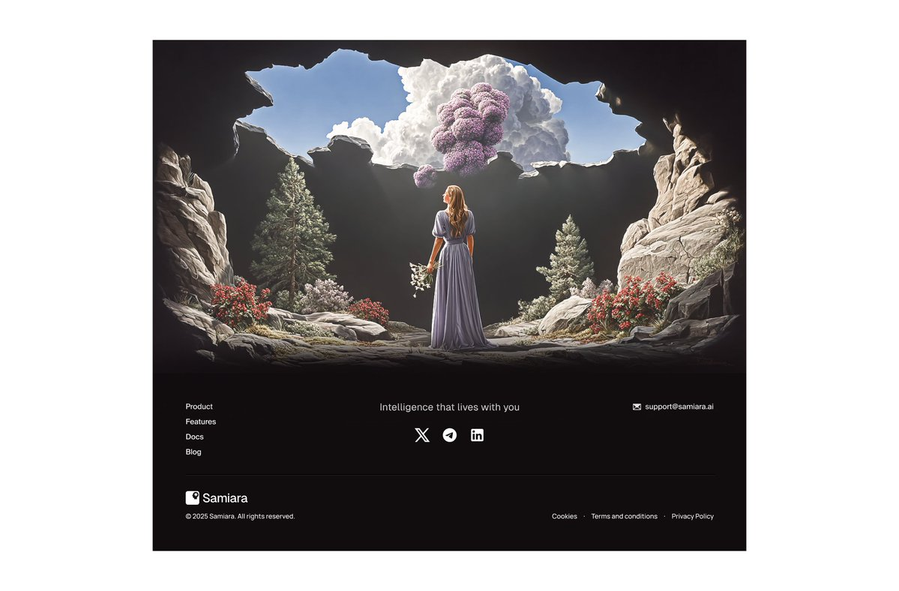

# Website Inspiration for Adam

Design references and inspiration for the Adam website.

## Footer Design

**Source:** [@kuxshl on X](https://x.com/kuxshl/status/2022308134057095415)

**Zakk's notes:**
- Want a footer like this
- With a photo of Adam in a large impressive library
- Gothic library aesthetic to match Adam's persona

**Ideas:**
- Full-width footer with dramatic image
- Adam (Frankenstein's monster) seated among ancient books
- Moody lighting, tall bookshelves, leather-bound volumes
- Could be AI-generated image in Gothic style
